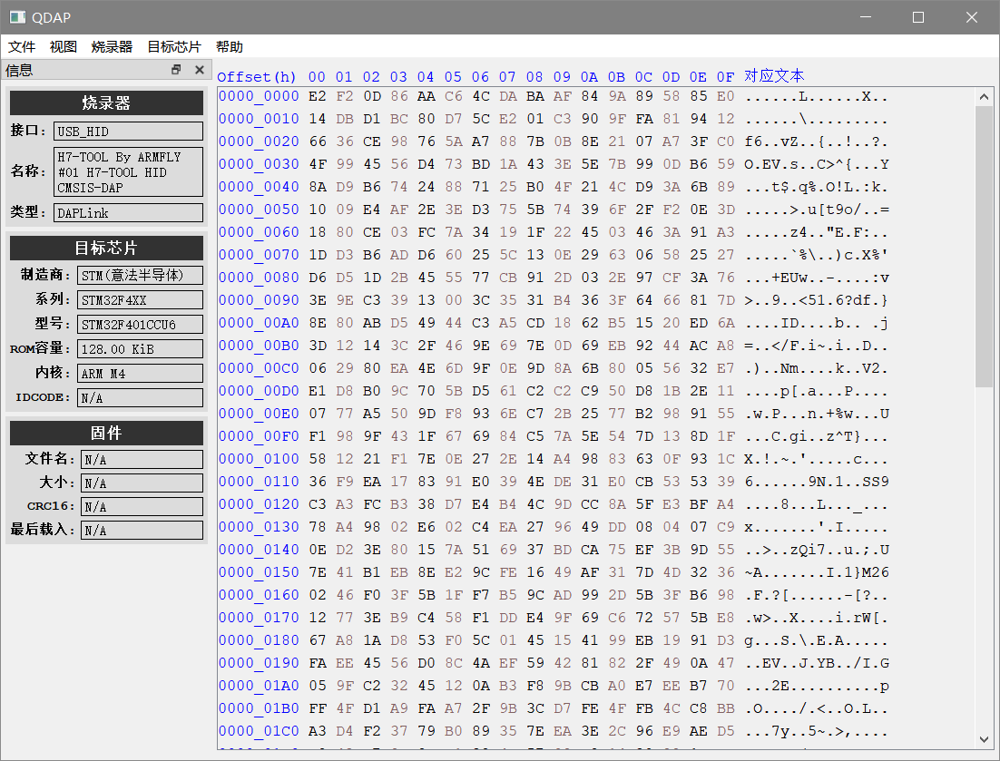
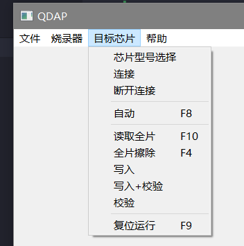
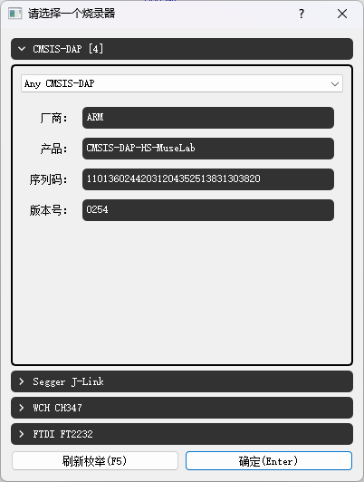

# Q-DAP


[](https://raw.githubusercontent.com/ma6254/qdap/master/LICENSE)
[](https://github.com/ma6254/qdap/releases)
[](https://github.com/ma6254/qdap/commits)


[](http://qm.qq.com/cgi-bin/qm/qr?_wv=1027&k=DkzYlCZ9VSQEq6CqUtqGiqYBZh1V5CKK&authKey=btu30mBqaqx6GSVS3futp%2BhYitMfhtAltmp%2B84Kob9xS%2F6J5yQkd0dSeozzxbclT&noverify=0&group_code=495477288)

[DAP-Link](https://github.com/ARM-software/CMSIS-DAP) upper by [Qt](http://qt.io)
 
chip device libray: <https://github.com/ma6254/qdap_chips>

## Development Progress

| 名称                     | Status  | 介绍                             |
| ------------------------ | ------- | -------------------------------- |
| 设备驱动 DAP_V1 usb_hid  | ✅已完成 |                                  |
| 设备驱动 DAP_V2 usb_bulk | 🚧开发中 | 设备枚举已完成，通讯未完成       |
| 设备驱动 CH347 usb       | 📦搁置   | 等WCH开放CH347的SWD相关的API接口 |
| 设备驱动 FT2232          | 📦搁置   |                                  |
| 设备驱动 JLink           | 📦搁置   | JLink有Segger全套上位机支持      |
| 芯片器件库的加载         | ✅已完成 |                                  |
| 芯片器件库的同步         | 🚧开发中 | 已完成zip的下载和解压            |
| 芯片型号选择界面         | ✅已完成 |                                  |
| RTT Viewer界面           | 📦搁置   |                                  |
| HexEdit界面              | ✅已完成 |                                  |
| 固件打开历史记录         | 📦搁置   |                                  |

## UI Preview







## Build

### Windows

```bash
git clone --recursive https://github.com/ma6254/QDAP.git
python vendor.py download
```

1. Download and install QT: [qt-unified-windows-x64-online.exe](https://qtproject.mirror.liquidtelecom.com/official_releases/online_installers/qt-unified-windows-x64-online.exe)
2. 文件 -> 打开文件或项目 -> CMakeLists.txt
3. 等待工程加载完成
4. 点击`运行(Ctrl+R)`

### Linux

1. 项目依赖：`git` `qt5` `libusb` `hidapi (hidraw)` `yaml-cpp` `cmake` `ninja`
2. 编译和安装

```bash
git clone https://github.com/ma6254/QDAP.git

cmake -S QDAP \
    -DCMAKE_BUILD_TYPE=None \
    -DCMAKE_INSTALL_PREFIX=/usr \
    -B build \
    -G Ninja

ninja -C build

ninja -C build install
```

### Arch Linux 或衍生版

1. 可以通过 [AUR 仓库](https://aur.archlinux.org/packages/qdap-git)或[自建源](https://github.com/taotieren/aur-repo)安装 `qdap`

```bash
yay -Syu qdap
```

注意： 包名 `qdap-git` 是开发版 `qdap` 是发行版

## Reference

- <https://github.com/libusb/hidapi>
- <https://github.com/openocd-org/openocd>
- <https://arm-software.github.io/CMSIS_5/DAP/html/index.html>
- <https://github.com/x893/CMSIS-DAP>
- <https://github.com/XIVN1987/DAPProg>
- <https://github.com/tthe207/DP-SW>
- <https://www.keil.arm.com/devices/>
- <https://en.wikipedia.org/wiki/Executable_and_Linkable_Format>

assets icons: <https://fonts.google.com/icons>

[glic_elf.h](./src/glibc_elf.h) from <https://github.com/lattera/glibc/blob/master/elf/elf.h>

[FlashOS.h](./src/FlashOS.h) from <https://github.com/ARM-software/CMSIS_4/blob/master/Device/_Template_Flash/FlashOS.h>
